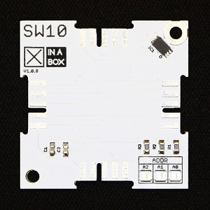

# ☒CHIP SW10

Digital (I2C) Temperature Sensor.

This module can be purchased on [Xinabox CC](https://xinabox.cc/products/SW10/).

## About the SW10
The SW10 makes use of the LM75B produced by NXP. The LM75B is an I2C digital temperature sensor that is available in various packages. It has a range of -55C to +125C, with a 0.125C resolution.

The SW10 module is housed in an extremely compact 2U×2U chip.

More information on the LM75B can be found in the [datasheet](https://www.nxp.com/docs/en/data-sheet/LM75B.pdf).

## Requirements
  - [xCore Library](https://github.com/xinabox/xCore)
  - [Arduino IDE 1.8.1](https://www.arduino.cc/en/main/software)

## Installation Guide
To install the libraries please followed the guide provided on the [Arduino Website](https://www.arduino.cc/en/Guide/Libraries) under "**Importing a .zip Library**".

